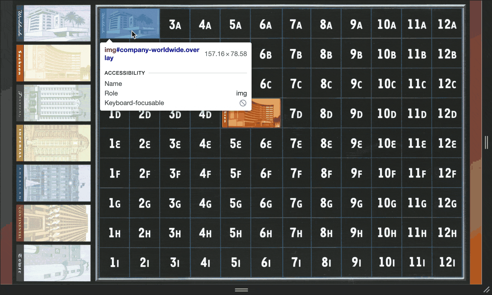
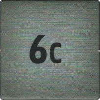
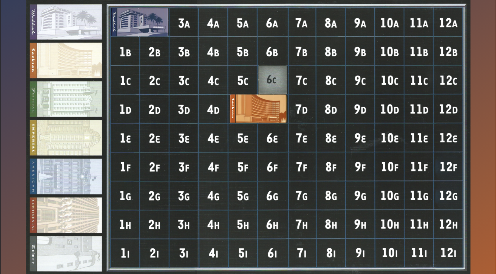

# Responsive Sprites

Sample project for responsive, sprite-based browser games.

## About

Unlike traditional webpage-layouts, browser-games are commonly based on sprites rather than textual markup elements.  
Optimized layout of a sprite based UI is challenging:

 * Spites' relative positioning involves overlaps.
 * Sprite scaling and positioning depends on the available application canvas.

This repository serves as a minimal sample to provide reusable code for a responsive, sprite-based layout.


## Layout

The demo uses three sample sprites of the board game *[Acquire](https://boardgamegeek.com/boardgame/5/acquire)*.

 * A backdrop. (Grid with available company / tile positions)
 * Two companies. (Placed on the grid)



## Important files

For implementation details, inspect the following files:

 * [```index.html```](index.html): Minimal DOM tree referencing sprites as ```img``` elements.
 * [```renderer.js```](renderer.js): Client side computations to convert absolute layout coordinates into relative coordinates, based on an optimized responsive UI fit.
 * [```absolutePositions.js```](absolutePositions.js): Properties file to provide absolute overlay element coorindates converted by the renderer.
 * [```style.css```](style.css): Enables responsive backdrop layout and enables relative element overlaying.

## Usage

This section exemplifies how new sprites can be added.

 1. Add a new sprite resource.
    * The added sprite must be on scale with the [backdrop](sprites/backdrop.png).
    * For convenience the required sprite is already present, at [```sprites/tiles/6c.png```](sprites/tiles/6c.png)
 2. Determine the absolute pixel position.
    * Determine the x/y pixel distance of the sprite's target origin from the backdrop origin.
      * *origin* is the *top-left* corner.
      * Pixel distance must be measured using the actual canvas size.
    * Example: Desired origin of **6C** is at ```x: 1648, y: 465```

 3. Add the measured *absolute* position (Step 2) to the [```absolutePositions.js```](absolutePositions.js) properties file.
```javascript
   absPos = {
       // tile positions
       tile_6c: {x: 1648, y: 465}
       ...
   };
```
 4. Add the sprite as image as child of the ```spriteContainer```DOM element.
    * Make sure it extends the ```overlay``` CSS class.
    * Give it a unique id, e.g.: ```tile-6c```.
    * Add the sprite location as ```src``` attribute.
    * Example:  
```html
   <div id="spriteContainer">
       
       ...
       
   </div>
```
 5. Make sure your sprite is rendered.
    * Edit ```renderer.js:render()```.
    * Add a call to ```relativePlaceOverlay(domElementId, podId, scaling)```, where:
      * ```domElementId``` matches the id string you chose. (Step 4)
      * ```posId``` matches the absolute position entry identifier. (Step 3)
      * ```scaling``` is the result of ```getScaling();```.
    * Example:  
```javascript
    relativePlaceOverlay('tile-6c', 'tile_6c', scaling);
```

Outcome:  



## Contact / Pull Requests

 * Author: Maximilian Schiedermeier 
 * Github: Kartoffelquadrat
 * Webpage: https://www.cs.mcgill.ca/~mschie3
 * License: [MIT](https://opensource.org/licenses/MIT)
